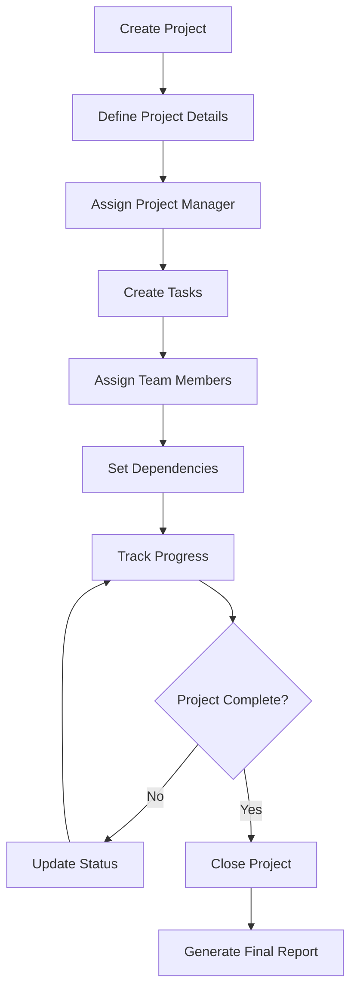
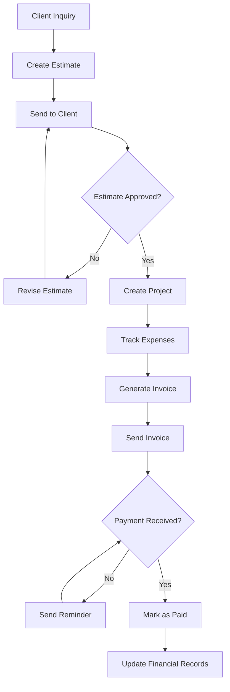
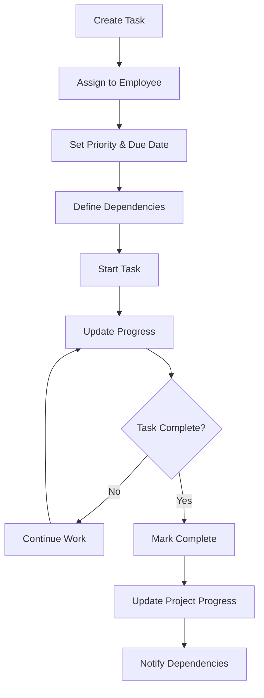
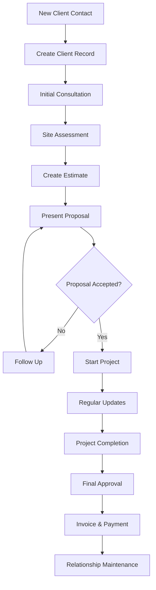
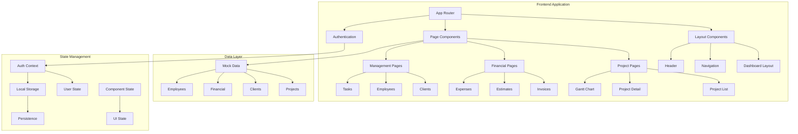
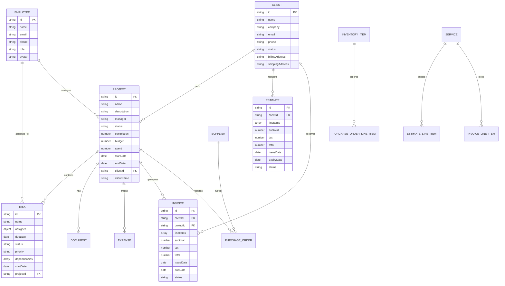
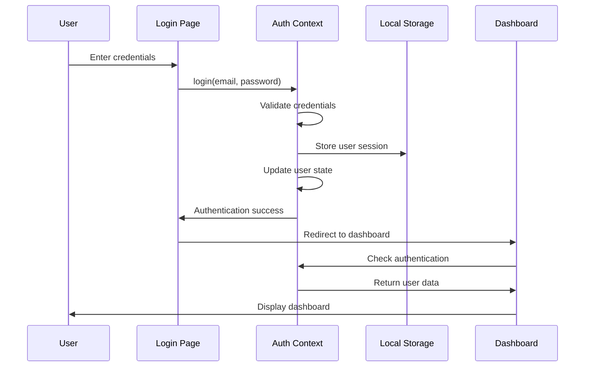
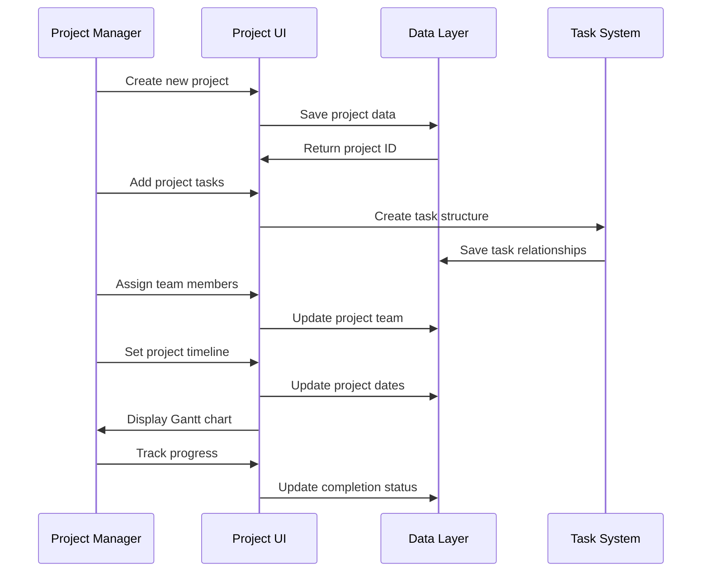

# Sebenza Construction - Architectural Document

## Table of Contents
1. [High-Level Application Overview](#high-level-application-overview)
2. [Main Components](#main-components)
3. [Data Models](#data-models)
4. [Core Workflows](#core-workflows)
5. [Technology Stack](#technology-stack)
6. [Authentication & Authorization](#authentication--authorization)
7. [Architecture Diagrams](#architecture-diagrams)
8. [Development & Deployment](#development--deployment)

## High-Level Application Overview

### Purpose
Sebenza Construction is a comprehensive construction project management application designed to streamline construction operations, project tracking, client management, and financial oversight. The platform provides a unified dashboard for construction companies to manage their entire workflow from initial estimates to project completion.

### Key Features
- **Project Management**: Complete project lifecycle management with Gantt charts, task assignments, and progress tracking
- **Financial Management**: Invoicing, estimates, expense tracking, and financial reporting
- **Resource Management**: Employee management, inventory tracking, and resource allocation
- **Client Relations**: Client management, document sharing, and communication tools
- **Analytics & Reporting**: Real-time dashboards, financial insights, and progress analytics
- **Document Management**: Project documents, purchase orders, and file organization
- **Calendar Integration**: Project timelines, deadlines, and event management

### Target Users
- **Construction Company Owners**: Complete system oversight and financial management
- **Project Managers**: Project execution, team coordination, and progress tracking
- **Site Supervisors**: Task management and on-site coordination
- **Administrative Staff**: Client communication, invoicing, and document management

## Main Components

### Frontend Architecture
The application follows a modern React-based architecture using Next.js 15.3.3 with the following layers:

#### 1. **Application Layer (`src/app/`)**
- **Route Structure**: App Router with nested layouts and pages
- **Authentication**: Login/signup flows with protected routes
- **Dashboard**: Comprehensive management interface with multiple modules
- **Module Pages**: Dedicated pages for each business domain (projects, invoices, clients, etc.)

#### 2. **Component Layer (`src/components/`)**
- **UI Components**: Reusable Radix UI-based components with Tailwind CSS styling
- **Business Components**: Domain-specific components for forms, dialogs, and data displays
- **Layout Components**: Navigation, headers, and structural elements
- **Visualization Components**: Charts, Gantt charts, and progress indicators

#### 3. **Context Layer (`src/contexts/`)**
- **Authentication Context**: User authentication state management
- **Global State**: Application-wide state management for user sessions

#### 4. **Utility Layer (`src/lib/`)**
- **Data Layer**: Type definitions and mock data for development
- **Utilities**: Common functions, formatting, and helper methods

### Backend Architecture (Local/Mock)
Currently implemented as a local-first application with:
- **Local Storage**: User authentication persistence
- **In-Memory State**: Runtime data management
- **Mock Data**: Comprehensive sample data for all entities
- **Client-Side Logic**: Business logic implemented in React components

### Database Design (Conceptual)
While currently using mock data, the application is designed with a relational database structure including:
- **Core Entities**: Projects, Tasks, Clients, Employees, Invoices, Estimates
- **Financial Entities**: Expenses, Purchase Orders, Inventory Items
- **Supporting Entities**: Documents, Events, Support Tickets
- **Relationships**: Proper foreign key relationships between entities

## Data Models

### Core Business Entities

#### Project
```typescript
type Project = {
  id: string;
  name: string;
  description: string;
  manager: string;
  status: "On Track" | "At Risk" | "Off Track";
  completion: number;
  budget: number;
  spent: number;
  startDate: Date;
  endDate: Date;
  tasks: Task[];
  team: Employee[];
  documents: Document[];
  clientId: string;
  clientName: string;
}
```

#### Task
```typescript
type Task = {
  id: string;
  name: string;
  assignee: {
    name: string;
    avatar: string;
  };
  dueDate: Date;
  status: "Done" | "In Progress" | "To Do";
  priority: "Low" | "Medium" | "High" | "Urgent";
  dependencies?: string[];
  startDate: Date;
  projectId: string;
}
```

#### Client
```typescript
type Client = {
  id: string;
  name: string;
  company: string;
  email: string;
  phone: string;
  status: "Active" | "Inactive";
  billingAddress: string;
  shippingAddress: string;
}
```

#### Invoice
```typescript
type Invoice = {
  id: string;
  clientId: string;
  clientName: string;
  projectId: string;
  projectName: string;
  lineItems: InvoiceLineItem[];
  subtotal: number;
  tax: number;
  discount: number;
  total: number;
  issueDate: Date;
  dueDate: Date;
  status: "Draft" | "Sent" | "Paid" | "Overdue" | "Partial";
  notes?: string;
  terms?: string;
  isRecurring?: boolean;
  recurringInterval?: 'days' | 'weeks' | 'months';
  recurringPeriod?: number;
  lateFeeType?: 'Percentage' | 'Flat Rate';
  lateFeeValue?: number;
  automatedReminders?: boolean;
}
```

#### Employee
```typescript
type Employee = {
  id: string;
  name: string;
  email: string;
  phone: string;
  role: "Project Manager" | "Site Supervisor" | "Electrician" | "Plumber" | "Laborer";
  avatar: string;
}
```

#### Estimate
```typescript
type Estimate = {
  id: string;
  clientId: string;
  clientName: string;
  lineItems: EstimateLineItem[];
  subtotal: number;
  tax: number;
  discount: number;
  total: number;
  issueDate: Date;
  expiryDate: Date;
  status: "Draft" | "Sent" | "Accepted" | "Declined";
  notes?: string;
  terms?: string;
}
```

#### Expense
```typescript
type Expense = {
  id: string;
  description: string;
  amount: number;
  category: "Materials" | "Labor" | "Permits" | "Subcontractor" | "Other";
  date: Date;
  projectId: string;
  projectName: string;
  isBillable: boolean;
  isRecurring: boolean;
  receiptUrl?: string;
}
```

### Supporting Entities

#### Document
```typescript
type Document = {
  id: string;
  name: string;
  type: "PDF" | "Image" | "Word" | "Excel";
  uploadDate: Date;
  projectId: string;
  projectName: string;
  url: string;
}
```

#### InventoryItem
```typescript
type InventoryItem = {
  id: string;
  sku: string;
  name: string;
  description: string;
  supplierId: string;
  supplierName: string;
  quantity: number;
  costPrice: number;
  sellingPrice: number;
  lowStockThreshold: number;
}
```

#### SupportTicket
```typescript
type SupportTicket = {
  id: string;
  subject: string;
  department: 'Finance' | 'Sales' | 'Technical Support' | 'General Inquiry';
  priority: 'Low' | 'Normal' | 'High';
  status: 'Open' | 'In Progress' | 'Resolved' | 'Closed';
  description: string;
  createdAt: Date;
}
```

## Core Workflows

### 1. **Project Management Workflow**


**Key Steps:**
1. **Project Creation**: Define project scope, budget, timeline, and client
2. **Team Assignment**: Assign project manager and team members
3. **Task Breakdown**: Create detailed task structure with dependencies
4. **Progress Tracking**: Monitor task completion and project milestones
5. **Resource Management**: Track budget, expenses, and resource allocation
6. **Documentation**: Maintain project documents and communications
7. **Completion**: Final review, client approval, and project closure

### 2. **Financial Management Workflow**


**Key Steps:**
1. **Estimate Creation**: Generate detailed quotes with line items, taxes, and terms
2. **Client Approval**: Track estimate status and client feedback
3. **Project Initiation**: Convert approved estimates to active projects
4. **Expense Tracking**: Monitor project costs and billable expenses
5. **Invoicing**: Generate and send invoices based on project milestones
6. **Payment Processing**: Track payments and manage overdue accounts
7. **Financial Reporting**: Generate financial insights and profitability analysis

### 3. **Task Management Workflow**


**Key Steps:**
1. **Task Creation**: Define task scope, requirements, and deliverables
2. **Assignment**: Assign tasks to appropriate team members
3. **Scheduling**: Set start dates, due dates, and dependencies
4. **Execution**: Track task progress and status updates
5. **Completion**: Mark tasks complete and update project status
6. **Reporting**: Generate task reports and performance metrics

### 4. **Client Management Workflow**


**Key Steps:**
1. **Client Onboarding**: Capture client information, contacts, and requirements
2. **Consultation**: Understand project scope and client expectations
3. **Proposal**: Create and present detailed project proposals
4. **Communication**: Maintain regular client updates and feedback
5. **Documentation**: Manage contracts, approvals, and change orders
6. **Completion**: Final delivery, approval, and payment processing

## Technology Stack

### Frontend Technologies
- **Framework**: Next.js 15.3.3 (React 18.3.1)
- **Language**: TypeScript
- **Styling**: Tailwind CSS with custom design system
- **UI Components**: Radix UI primitives
- **Icons**: Lucide React
- **Charts**: Recharts for data visualization
- **Forms**: React Hook Form with Zod validation
- **Date Handling**: date-fns library
- **Carousel**: Embla Carousel React

### Development Tools
- **Package Manager**: npm
- **Build Tool**: Next.js with Turbopack
- **Linting**: ESLint with Next.js configuration
- **Type Checking**: TypeScript compiler
- **Development Server**: Next.js dev server (port 9002)

### UI/UX Technologies
- **Design System**: Custom Tailwind CSS configuration
- **Component Library**: Radix UI for accessible components
- **Animations**: Tailwind CSS animations
- **Responsive Design**: Mobile-first responsive design
- **Typography**: Inter and Manrope font families
- **Color System**: Custom color palette with dark/light mode support

### State Management
- **Local State**: React useState and useEffect hooks
- **Context API**: React Context for authentication and global state
- **Form State**: React Hook Form for form management
- **Local Storage**: Browser localStorage for persistence

### Data Layer
- **Data Format**: TypeScript interfaces and types
- **Mock Data**: Comprehensive sample data in `src/lib/data.ts`
- **Data Validation**: Zod schemas for form validation
- **Date Management**: JavaScript Date objects with date-fns utilities

## Authentication & Authorization

### Authentication System
The application implements a local authentication system designed for development and demonstration purposes:

#### Authentication Context
```typescript
interface User {
  id: string;
  email: string;
  name: string;
  role: 'admin' | 'owner' | 'member';
}

interface AuthContextType {
  user: User | null;
  login: (email: string, password: string) => Promise<void>;
  logout: () => void;
  isLoading: boolean;
}
```

#### Key Features
- **Local Storage Persistence**: User sessions persist across browser sessions
- **Role-Based Access**: Three user roles with different permission levels
- **Protected Routes**: Dashboard routes require authentication
- **Automatic Session Management**: Checks for existing sessions on app load

### Authorization Levels

#### 1. **Admin Role**
- Full system access
- Employee management
- Settings configuration
- Support ticket management
- All financial operations

#### 2. **Owner Role**
- Business operations management
- Employee oversight
- Financial reporting
- Project management
- Client relations

#### 3. **Member Role**
- Limited project access
- Task management
- Basic reporting
- Client interaction

### Route Protection
- **Public Routes**: `/auth/login`, `/auth/signup`
- **Protected Routes**: All `/dashboard/*` routes
- **Role-Restricted Features**: Certain navigation items and functions based on user role

## Architecture Diagrams

### Application Component Architecture


### Data Model Relationships


### User Authentication Flow


### Project Management Flow


## Development & Deployment

### Local Development Setup

#### Prerequisites
- Node.js (v18 or higher)
- npm package manager
- Modern web browser

#### Installation Steps
```bash
# Clone the repository
git clone <repository-url>
cd sebenza-construction

# Install dependencies
npm install

# Start development server
npm run dev

# Open browser to http://localhost:9002
```

#### Available Scripts
- `npm run dev` - Start development server with Turbopack
- `npm run build` - Build production application
- `npm run start` - Start production server
- `npm run lint` - Run ESLint
- `npm run typecheck` - Run TypeScript type checking

### Project Structure
```
sebenza-construction/
├── src/
│   ├── app/                    # Next.js App Router
│   │   ├── auth/              # Authentication pages
│   │   ├── dashboard/         # Main application modules
│   │   ├── globals.css        # Global styles
│   │   ├── layout.tsx         # Root layout
│   │   └── page.tsx           # Home page (redirects to login)
│   ├── components/            # React components
│   │   ├── ui/               # Base UI components
│   │   └── *.tsx             # Feature components
│   ├── contexts/             # React contexts
│   │   └── auth-context.tsx  # Authentication context
│   ├── hooks/                # Custom React hooks
│   └── lib/                  # Utilities and data
│       ├── data.ts           # Mock data and type definitions
│       └── utils.ts          # Utility functions
├── public/                   # Static assets
├── docs/                     # Documentation
├── package.json             # Dependencies and scripts
├── next.config.ts           # Next.js configuration
├── tailwind.config.ts       # Tailwind CSS configuration
├── tsconfig.json           # TypeScript configuration
└── README.md               # Project documentation
```

### Key Configuration Files

#### Next.js Configuration
```typescript
// next.config.ts
const nextConfig = {
  experimental: {
    turbo: true
  }
};
```

#### Tailwind CSS Configuration
```typescript
// tailwind.config.ts
module.exports = {
  content: ["./src/**/*.{js,ts,jsx,tsx}"],
  theme: {
    extend: {
      fontFamily: {
        sans: ['var(--font-sans)', ...defaultTheme.fontFamily.sans],
        body: ['var(--font-manrope)', ...defaultTheme.fontFamily.sans],
      }
    }
  },
  plugins: [require("tailwindcss-animate")]
};
```

### Future Deployment Considerations

#### Production Deployment Options
1. **Vercel** (Recommended for Next.js)
2. **Netlify** for static deployment
3. **AWS/Azure/GCP** for cloud hosting
4. **Docker** containerization

#### Required Environment Variables
```bash
# Authentication (future implementation)
NEXTAUTH_SECRET=your-secret-key
NEXTAUTH_URL=your-app-url

# Database (future implementation)
DATABASE_URL=your-database-connection-string

# File Storage (future implementation)
AWS_S3_BUCKET=your-s3-bucket
AWS_ACCESS_KEY_ID=your-access-key
AWS_SECRET_ACCESS_KEY=your-secret-key
```

#### Production Checklist
- [ ] Configure environment variables
- [ ] Set up database (PostgreSQL/MySQL recommended)
- [ ] Configure file storage (AWS S3/CloudFront)
- [ ] Implement real authentication (NextAuth.js/Auth0)
- [ ] Set up monitoring and logging
- [ ] Configure SSL certificates
- [ ] Set up backup strategies
- [ ] Implement CI/CD pipeline

### Performance Optimization

#### Current Optimizations
- **Next.js 15** with Turbopack for fast development
- **Component lazy loading** for better performance
- **Responsive design** for mobile optimization
- **Optimized images** and assets

#### Future Optimizations
- **Database indexing** for query performance
- **CDN integration** for static assets
- **API caching** strategies
- **Bundle optimization** and code splitting
- **Progressive Web App** features

---

## Conclusion

Sebenza Construction represents a modern, scalable construction management platform built with cutting-edge web technologies. The current implementation provides a solid foundation for local development and testing, with a clear path for production deployment and feature expansion.

The architecture supports the complex needs of construction project management while maintaining simplicity and usability. With its comprehensive data models, intuitive workflows, and modern technical stack, the application is well-positioned for growth and adaptation to real-world construction business requirements.

**Document Version**: 1.0  
**Last Updated**: January 2025  
**Next Review**: Quarterly or upon major feature additions
